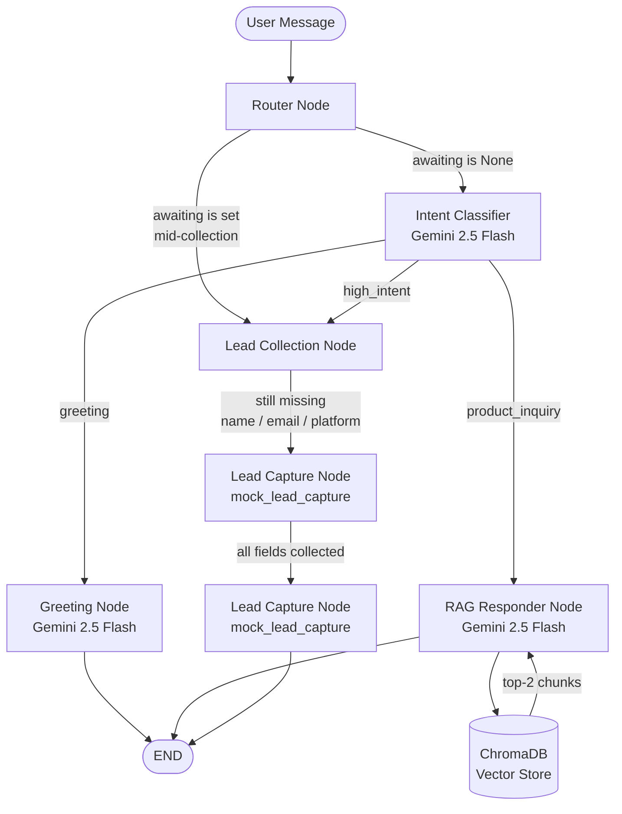
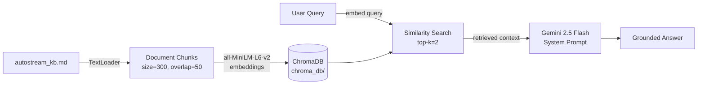
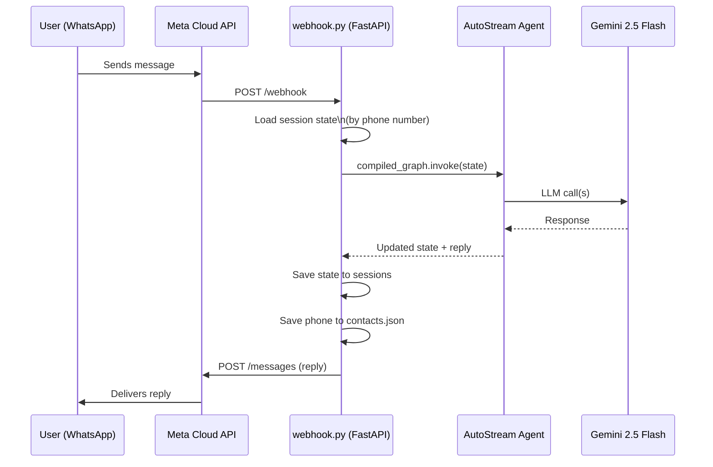
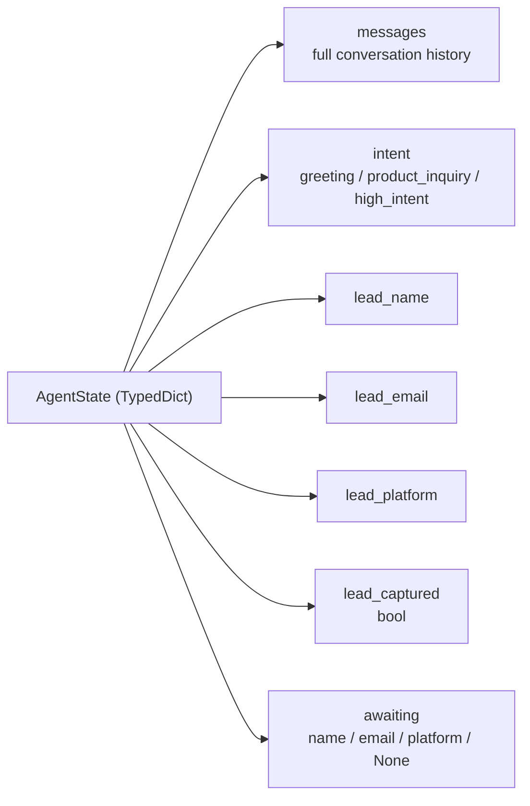

# 🎬 AutoStream AI Agent

A conversational AI agent for **AutoStream** — a fictional SaaS for AI-powered video editing tools. The agent:

- 🧠 **Identifies user intent** (greeting, product inquiry, or high-intent to buy)
- 📚 **Answers questions via RAG** from a local ChromaDB knowledge base
- 🎯 **Detects high-intent leads** and captures their details (name, email, platform) via a mock tool
- 💬 **Deploys on WhatsApp** via Meta Cloud API webhooks
- 📣 **Sends proactive marketing messages** to contacts using approved WhatsApp templates

All frameworks, models, and tools are **free and open-source**.

---

## Tech Stack

| Component | Choice |
|---|---|
| Agent Framework | LangGraph (stateful multi-turn) |
| LLM | Google Gemini 2.5 Flash (`gemini-2.5-flash`) |
| Embeddings | `sentence-transformers/all-MiniLM-L6-v2` (local) |
| Vector Store | ChromaDB (local, persistent) |
| RAG | LangChain + ChromaDB + sentence-transformers |
| Webhook Server | FastAPI + Uvicorn |
| Tunnel (dev) | ngrok |
| UI | CLI (`main.py`) + WhatsApp |

---

## How to Run (CLI)

```bash
# 1. Clone and enter the project
git clone <repo>
cd autostream-agent

# 2. Create and activate a virtual environment
python -m venv .venv
.venv\Scripts\activate      # Windows
# source .venv/bin/activate # macOS/Linux

# 3. Install dependencies
pip install -r requirements.txt

# 4. Configure your API key
cp .env.example .env
# Open .env and paste your GOOGLE_API_KEY
# Get one free at https://aistudio.google.com/app/apikey (no credit card required)

# 5. Run the agent
python main.py
```

---

## How to Run (WhatsApp Webhook)

You need **two terminals** running simultaneously.

**Terminal 1 — FastAPI server:**
```bash
cd autostream-agent
.venv\Scripts\activate
uvicorn webhook:app --reload --port 8000
```

**Terminal 2 — ngrok tunnel:**
```bash
ngrok http --domain=your-static-domain.ngrok-free.dev 8000
```

Then register the webhook URL in your Meta Developer dashboard. See `WHATSAPP_DEPLOYMENT.md` for the full step-by-step guide.

---

## Architecture

### LangGraph Agent Flow



### RAG Pipeline



### WhatsApp Webhook Flow



### State Management



---

## WhatsApp Deployment

See **`WHATSAPP_DEPLOYMENT.md`** for the complete guide including:
- Meta Developer app setup
- Getting your API token and Phone Number ID
- Registering the webhook with ngrok
- Production checklist (Redis sessions, permanent token, signature verification)

### Contact saving

Every time a new user messages the bot, their phone number is automatically saved to `contacts.json`. This powers the proactive marketing feature below.

---

## Proactive Marketing Messages

To send a WhatsApp marketing message with the AutoStream banner to all contacts:

### One-time setup
1. Create an approved Message Template named `autostream_promo` in Meta Business Suite
2. Upload your banner image to a public URL (e.g. imgbb.com)
3. Set `BANNER_URL` in `send_promo.py` to your image URL

### Send
```bash
python send_promo.py
```

This reads all numbers from `contacts.json` (populated automatically by the webhook) and sends each one the approved template with the banner image. When they reply, the agent picks up the conversation normally.

---

## Project Structure

```
autostream-agent/
├── knowledge_base/
│   └── autostream_kb.md      # RAG source (pricing, policies)
├── agent/
│   ├── __init__.py
│   ├── state.py              # AgentState TypedDict
│   ├── nodes.py              # 5 LangGraph node functions
│   ├── graph.py              # Graph assembly + compiled_graph
│   ├── rag.py                # ChromaDB RAG pipeline
│   └── tools.py              # mock_lead_capture tool
├── chroma_db/                # Auto-created on first run
├── contacts.json             # Auto-created by webhook (phone numbers)
├── main.py                   # CLI entry point
├── webhook.py                # FastAPI WhatsApp webhook server
├── send_promo.py             # Proactive marketing message sender
├── requirements.txt
├── .env.example
├── WHATSAPP_DEPLOYMENT.md    # Full WhatsApp setup guide
└── README.md
```

---

## Environment Variables

Copy `.env.example` to `.env` and fill in all values:

| Variable | Description | Where to get it |
|---|---|---|
| `GOOGLE_API_KEY` | Gemini LLM API key | https://aistudio.google.com/app/apikey |
| `WHATSAPP_VERIFY_TOKEN` | Secret string you invent | Make it up yourself |
| `WHATSAPP_API_TOKEN` | Meta access token | WhatsApp → API Setup in Meta dashboard |
| `WHATSAPP_PHONE_NUMBER_ID` | Your bot's phone number ID | WhatsApp → API Setup in Meta dashboard |

> **Note:** The Meta access token expires every 24 hours on the free tier. Regenerate it in the Meta dashboard and restart uvicorn when it expires. For production, generate a permanent token via System Users in Meta Business Manager.

---

## Expected Conversation Flow

```
You:   Hi!
Agent: Hey! 👋 Welcome to AutoStream — the AI-powered video editing platform…

You:   What's the Pro plan price?
Agent: The Pro plan is $79/month and includes unlimited videos, 4K resolution, and AI Captions.

You:   I want to sign up for the Pro plan for my YouTube channel.
Agent: I'd love to get you started! 🎬 First, what's your name?

You:   John Doe
Agent: Thanks, John Doe! What's your email address?

You:   johndoe@gmail.com
Agent: Almost there! Which platform do you mainly create content on?

You:   YouTube
Agent: 🎉 Thanks, John Doe! You're all set. Our team will reach out to
       johndoe@gmail.com very soon. We can't wait to see your YouTube content level up! 🚀
```
